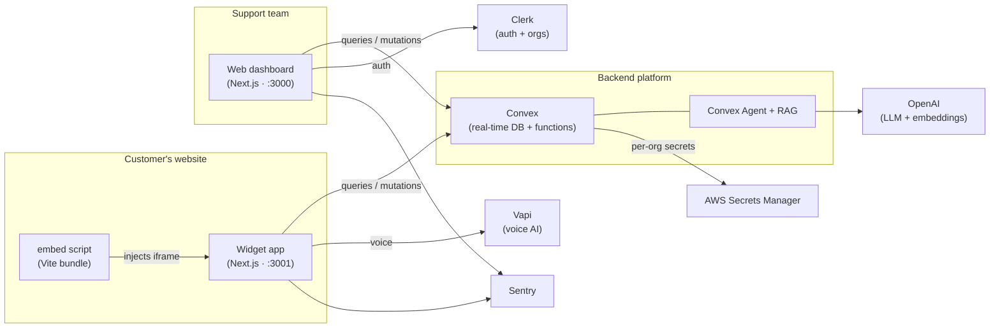

# IDS — AI Customer Support Platform

An AI-powered, multi-tenant B2B customer support platform. IDS lets any business drop an
intelligent support widget onto its website, answer customers automatically from its own
knowledge base, escalate to human operators when needed, and handle both **chat** and
**voice** conversations from a single dashboard.

Built as a modern **Turborepo** monorepo with a real-time **Convex** backend, retrieval-augmented
generation (RAG) over uploaded documents, and voice AI powered by **Vapi**.

<p>
  
  
  
  
  
  
  
</p>

---

## Table of Contents

- [Overview](#overview)
- [Key Features](#key-features)
- [Architecture](#architecture)
- [Tech Stack](#tech-stack)
- [Monorepo Structure](#monorepo-structure)
- [Data Model](#data-model)
- [Getting Started](#getting-started)
- [Environment Variables](#environment-variables)
- [Available Scripts](#available-scripts)
- [Applications & Ports](#applications--ports)
- [Deployment](#deployment)
- [Roadmap](#roadmap)
- [License](#license)

---

## Overview

IDS is a SaaS product that gives businesses an end-to-end customer support experience:

1. **Customers** interact with a lightweight widget that can be embedded on any website with a
   single script tag. They can chat with an AI assistant or start a voice call.
2. The **AI assistant** answers using a per-organization knowledge base (documents uploaded by the
   business) through retrieval-augmented generation, and can escalate to a human when it can't help.
3. **Support operators** manage every conversation from a real-time dashboard — triaging,
   replying, resolving, and configuring how the assistant behaves.

The platform is **multi-tenant** from the ground up: every organization has its own settings,
knowledge base, conversations, billing, and integrations, isolated by an `organizationId`.

---

## Key Features

- **AI-first support** — Retrieval-augmented answers grounded in each organization's own uploaded
  documents, powered by OpenAI and the Convex Agent + RAG components.
- **Chat & voice** — Text conversations plus real-time voice calls via Vapi (assistants and phone
  numbers configurable per organization).
- **Embeddable widget** — A tiny script injects the customer widget as an iframe into any website,
  with configurable position and organization targeting.
- **Real-time operator dashboard** — Live conversation list with `unresolved` / `escalated` /
  `resolved` states, a contact panel with rich visitor metadata, and instant updates via Convex.
- **Knowledge base / files** — Upload and manage documents that become the assistant's context.
- **Customization** — Greeting message, quick-reply suggestions, and Vapi voice settings per org.
- **Integrations & plugins** — Install snippet for the widget and a Vapi plugin for voice AI, with
  provider secrets stored securely in AWS Secrets Manager.
- **Authentication & organizations** — Sign-in / sign-up and organization selection powered by
  Clerk, with Convex authenticated through Clerk JWTs.
- **Billing** — Subscription-gated premium features with a pricing table and paywall overlays.
- **Error monitoring** — First-class Sentry instrumentation across server, edge, and client.

---

## Architecture



The three frontends all talk to a single Convex deployment, which holds the shared data model and
business logic. RAG and agent orchestration run inside Convex; provider credentials (e.g. Vapi keys)
are stored per organization in AWS Secrets Manager rather than in the database.

---

## Tech Stack

| Layer | Technologies |
| --- | --- |
| **Frontend** | Next.js 15 (App Router), React 19, TypeScript 5.7 |
| **UI** | Tailwind CSS, shadcn/ui, Radix UI, lucide-react, sonner, next-themes |
| **State & forms** | Jotai, React Hook Form, Zod |
| **Backend** | Convex (real-time database + serverless functions) |
| **AI** | OpenAI, Vercel AI SDK, `@convex-dev/agent`, `@convex-dev/rag` |
| **Voice** | Vapi (`@vapi-ai/web`, `@vapi-ai/server-sdk`) |
| **Auth** | Clerk (organizations, JWT templates for Convex) |
| **Secrets** | AWS Secrets Manager |
| **Webhooks** | Svix |
| **Monitoring** | Sentry |
| **Tooling** | Turborepo, pnpm workspaces, Vite (embed build), ESLint, Prettier |

---

## Monorepo Structure

```
.
└── next15-echo/                # workspace root (Turborepo + pnpm)
    ├── apps/
    │   ├── web/                # Operator dashboard (Next.js · port 3000)
    │   │   └── modules/        # auth · dashboard · customization · billing
    │   │                       #   files · integrations · plugins
    │   ├── widget/             # Customer chat/voice widget (Next.js · port 3001)
    │   └── embed/              # Embeddable loader script (Vite · port 3002)
    └── packages/
        ├── backend/            # Convex schema, functions, agent & RAG config
        ├── ui/                 # Shared shadcn/ui component library
        ├── math/               # Example shared package
        ├── eslint-config/      # Shared ESLint configuration
        └── typescript-config/  # Shared TypeScript configuration
```

Internal packages are consumed through workspace aliases such as `@workspace/ui`,
`@workspace/backend`, and `@workspace/math`.

---

## Data Model

The Convex schema (`packages/backend/convex/schema.ts`) defines the core tables, all scoped by
`organizationId`:

| Table | Purpose |
| --- | --- |
| `conversations` | A support thread with a `status` of `unresolved`, `escalated`, or `resolved`. |
| `contactSessions` | A customer's session, including rich device/browser metadata and an expiry. |
| `widgetSettings` | Per-org greeting message, quick-reply suggestions, and Vapi settings. |
| `plugins` | Installed provider integrations (e.g. `vapi`) referencing a stored secret. |
| `subscriptions` | Organization subscription status for billing gating. |
| `users` | Application users. |

---

## Getting Started

### Prerequisites

- **Node.js** ≥ 20
- **pnpm** 10 (`corepack enable` will provide the pinned version)
- A **Convex** account/deployment
- A **Clerk** application (with organizations enabled)
- Optional for full functionality: **OpenAI**, **Vapi**, **AWS**, and **Sentry** credentials

### Installation

```bash
# clone
git clone https://github.com/suleman-the-stammer/IDS-Project.git
cd IDS-Project/next15-echo

# install all workspace dependencies
pnpm install
```

### Configure the backend

```bash
# from the workspace root, provision the Convex backend
pnpm --filter @workspace/backend run setup
```

Set the environment variables below in each app and in your Convex dashboard, then start
everything with Turborepo:

```bash
pnpm dev
```

This runs the dashboard, widget, and embed dev servers together. You can also run a single app
with a filter, e.g. `pnpm --filter web dev`.

---

## Environment Variables

Create a `.env.local` in the relevant app(s) and configure your Convex deployment. Names below are
representative of what the code expects:

| Variable | Where | Description |
| --- | --- | --- |
| `NEXT_PUBLIC_CONVEX_URL` | web, widget | Convex deployment URL. |
| `CONVEX_DEPLOYMENT` | backend | Convex deployment identifier. |
| `NEXT_PUBLIC_CLERK_PUBLISHABLE_KEY` | web | Clerk publishable key. |
| `CLERK_SECRET_KEY` | web / backend | Clerk secret key. |
| `CLERK_JWT_ISSUER_DOMAIN` | Convex dashboard | Clerk issuer for the `convex` JWT template. |
| `OPENAI_API_KEY` | backend | LLM + embeddings for RAG/agent. |
| `AWS_ACCESS_KEY_ID` / `AWS_SECRET_ACCESS_KEY` / `AWS_REGION` | backend | AWS Secrets Manager access. |
| `NEXT_PUBLIC_SENTRY_DSN` / `SENTRY_AUTH_TOKEN` | web | Error monitoring & source maps. |
| `VITE_WIDGET_URL` | embed | URL of the deployed widget app. |

> Vapi provider keys are stored **per organization** in AWS Secrets Manager via the plugins system,
> not as global environment variables.

---

## Available Scripts

Run from the workspace root (`next15-echo/`):

| Command | Description |
| --- | --- |
| `pnpm dev` | Start all apps in development via Turborepo. |
| `pnpm build` | Build all apps and packages. |
| `pnpm lint` | Lint the entire workspace. |
| `pnpm format` | Format files with Prettier. |
| `pnpm --filter web dev` | Run only the operator dashboard. |
| `pnpm --filter widget dev` | Run only the customer widget. |
| `pnpm --filter embed dev` | Run only the embed bundle. |

---

## Applications & Ports

| App | Description | Dev URL |
| --- | --- | --- |
| **web** | Operator/agent support dashboard | http://localhost:3000 |
| **widget** | Customer-facing chat & voice widget | http://localhost:3001 |
| **embed** | Standalone embeddable loader script | http://localhost:3002 |

To embed the widget on an external site, include the built loader script and target your
organization:

```html
<script src="https://your-domain.com/embed.js" data-organization-id="YOUR_ORG_ID" async></script>
```

---

## Deployment

- **Backend** — deploy the Convex functions with `convex deploy` and configure production
  environment variables (Clerk issuer, OpenAI, AWS) in the Convex dashboard.
- **web / widget** — deploy the Next.js apps (e.g. to Vercel). Set the public Convex and Clerk
  variables and connect Sentry for release health.
- **embed** — build the Vite bundle (`pnpm --filter embed build`) and host the resulting script on
  your CDN.

---

## Roadmap

- Analytics and reporting for conversation volume and resolution time
- Additional voice/messaging channel integrations
- Team roles and granular permissions
- Automated escalation rules and SLA tracking

---

## License

Released under the **MIT License**. See [`LICENSE`](LICENSE) for details.
